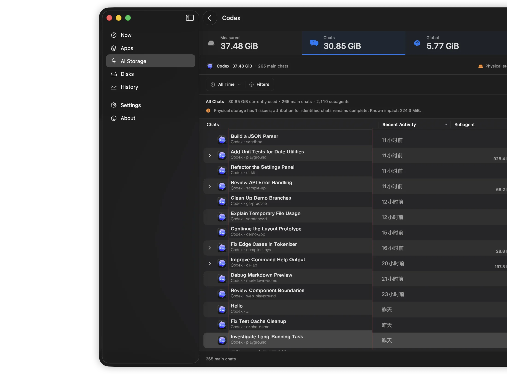

<div align="center">
  
  <h1>FindDiskKiller</h1>
  <p><strong>Descubra qual app mantém seu disco ocupado.</strong></p>
  <p>E/S de disco, CPU, rede, atividade de arquivos e integridade das unidades em um único espaço de trabalho nativo do macOS.</p>
  <p>
    <a href="README.md">English</a> · <a href="README.zh-CN.md">简体中文</a> ·
    <a href="README.zh-TW.md">繁體中文</a> · <a href="README.ja.md">日本語</a> ·
    <a href="README.ko.md">한국어</a> · <a href="README.de.md">Deutsch</a> ·
    <a href="README.fr.md">Français</a> · <a href="README.es.md">Español</a> ·
    <a href="README.pt-BR.md">Português (Brasil)</a> · <a href="README.ru.md">Русский</a>
  </p>
  <p><strong>macOS 14+ · Apple Silicon e Intel · Processamento local · Interface em 10 idiomas</strong></p>
  <p><a href="https://finddiskkiller.com/pt-br/download/">Baixar</a> · <a href="https://finddiskkiller.com/pt-br/">Site oficial</a> · <a href="docs/find-disk-killer-product-and-technical-plan.md">Modelo do produto</a> · <a href="SUPPORT.md">Suporte</a> · <a href="PRIVACY.md">Privacidade</a></p>
</div>

---

<p align="center"></p>
<p align="center"><sub>Encontre atividade contínua do disco e identifique os apps responsáveis.</sub></p>

Quando o Mac esquenta e o disco continua ocupado, uma simples lista de processos
nem sempre explica a causa. O FindDiskKiller organiza a investigação em torno
dos apps: detecta carga contínua, identifica o app principal e reúne CPU, E/S de
disco, rede, arquivos e contexto de armazenamento no mesmo lugar.

## Meça também o espaço dos agentes de IA

O AI Storage mede dados do Codex e Claude somente após uma ação explícita e atribui o espaço identificável a cada thread/session, conversa principal e subagente recursivo. Arquivos medidos e estimativas do banco de dados permanecem separados; evidências incompletas nunca são apresentadas como exatas.

<p align="center"></p>

<p align="center"></p>

Selecione período, projeto ou conversas e revise o espaço de liberação imediata estimado antes da exclusão permanente. O Codex usa thread/delete oficial e sessões independentes do Claude Code usam o Agent SDK oficial. Itens ativos, alterados ou incompatíveis são ignorados, sem gravação direta no SQLite nem remoção manual de transcripts. Claude Desktop/Cowork deve ser excluído atualmente no Claude Desktop.

<p align="center"></p>

## O essencial em uma única visão

| Área | O que você vê |
| --- | --- |
| **Atividade dos apps** | CPU, leitura, gravação, download e upload dos últimos 5 segundos; colunas ordenáveis e redimensionáveis, com ícones nativos |
| **Linha do tempo** | Gráficos com segmentos retos de 1 minuto, 15 minutos e 1 hora, com horário e valores exatos ao passar o ponteiro |
| **Detalhes do processo** | Janelas independentes para comparar CPU, disco, rede e evidências de arquivos |
| **Atividade de arquivos** | Locais abertos e diretórios onde mudanças foram observadas nos últimos 5 minutos |
| **Rastreamento de acesso** | Sob demanda: leituras e gravações solicitadas, taxas de 5 segundos, picos da sessão, arquivos ativos e processos verificados |
| **Discos** | Vazão dos dispositivos físicos com nomes de volumes fáceis de reconhecer, inclusive armazenamento externo |
| **Integridade da unidade** | Temperatura, gravações do host, desgaste, reserva, histórico de energia e erros quando o macOS fornece esses dados |
| **Barra de menus** | Estado atual de forma discreta, sem notificações repetitivas |

## Uma visão completa, do app ao disco

### Comece pelo app responsável

<p align="center"></p>

### Passe para locais e acessos limitados

<p align="center"></p>

<p align="center"></p>

### Termine com o armazenamento e sua integridade

<p align="center"></p>

<p align="center"></p>

## Uma investigação em um só contexto

```text
Atividade contínua
        |
        v
App principal  -->  CPU / disco / download / upload
        |
        v
Arquivos abertos e mudanças recentes
        |
        v
Rastreamento opcional e limitado de arquivo ou pasta
        |
        v
Vazão física e dados de integridade disponíveis
```

A CPU aparece sempre primeiro. Leitura e gravação, download e upload continuam
separados. Os valores atuais usam os últimos cinco segundos. Ao inspecionar uma
linha, apenas a reordenação visual é pausada; ela continua clicável. Os detalhes
do processo são abertos em janelas independentes.

## Sem falsa precisão

- A **E/S de disco do app** vem dos contadores do processo e inclui todo o armazenamento usado por ele.
- A **vazão do dispositivo** vem dos contadores físicos e é exibida com nomes como `Macintosh HD` ou `ExternalSSD`.
- As **mudanças recentes** indicam que o macOS observou uma alteração; sozinhas, elas não identificam o processo responsável.
- O **rastreamento de acesso** mede os bytes solicitados por chamadas de sistema bem-sucedidas. Cache, gravação adiada do APFS, compactação, copy-on-write, mapeamento de memória e lacunas de cobertura fazem esses valores diferirem das gravações físicas ou NAND.
- A **integridade da unidade** mostra apenas os campos realmente fornecidos pelo macOS. Um dado ausente continua indisponível, em vez de virar zero.

O FindDiskKiller não afirma atribuir com exatidão cada byte de um processo a um disco físico específico.

## Privacidade e permissões

O monitoramento e a análise são feitos localmente. A versão atual não contém
anúncios, telemetria, análise comportamental nem SDKs de rastreamento de terceiros,
e não envia atividade de processos, caminhos, histórico ou números de série.

O monitoramento básico não exige aprovação de administrador. Somente quando você
inicia explicitamente o rastreamento de um arquivo ou pasta o macOS pode pedir a
aprovação do componente em segundo plano assinado. Ele só pode supervisionar uma
sessão limitada de `/usr/bin/fs_usage`, com parâmetros fixos, e não pode executar
shell nem comandos arbitrários.

Leia a [Política de Privacidade](PRIVACY.md) e a [Política de Segurança](SECURITY.md).

## Requisitos e instalação

- macOS 14 ou posterior
- Mac com Apple Silicon ou Intel
- Conta de administrador apenas para ativar o rastreamento de acesso sob demanda

Quando disponíveis, as versões oficiais são distribuídas como DMG universal2, assinado com Developer ID e notarizado pela Apple.

1. Baixe a versão mais recente no [site oficial](https://finddiskkiller.com/pt-br/download/).
2. Abra o DMG e arraste o FindDiskKiller para Aplicativos.
3. Inicie o FindDiskKiller em Aplicativos.

Cada versão oficial publica seu SHA-256. Não ignore o Gatekeeper caso um pacote não passe na validação.

## Compilação e testes

O desenvolvimento requer Xcode 16 ou posterior e XcodeGen 2.42.0 ou posterior.

```bash
git clone https://github.com/jianyintang/find-disk-killer.git
cd find-disk-killer
xcodegen generate
xcodebuild -project FindDiskKiller.xcodeproj \
  -scheme FindDiskKillerApp -configuration Release \
  -destination 'generic/platform=macOS' \
  CODE_SIGNING_ALLOWED=NO ONLY_ACTIVE_ARCH=NO build
swift test
```

O build de desenvolvimento sem assinatura permite validar o monitoramento
básico, mas não executar o rastreamento privilegiado de arquivos ou pastas. O
app e o helper se autenticam pelo Team ID do mantenedor, portanto esse fluxo
deve ser verificado com um build oficial assinado. A aprovação do componente em
segundo plano e o Acesso Total ao Disco para locais protegidos são permissões
separadas do macOS.

Para criar uma versão assinada e notarizada a partir de um commit limpo:

```bash
make lint test
make release VERSION=1.0.0 BUILD_NUMBER=100
```

Artefatos gerados com `SKIP_NOTARIZATION=1` servem apenas para ensaios locais e nunca devem ser publicados.

## Documentação e suporte

- [Plano de produto e técnico](docs/find-disk-killer-product-and-technical-plan.md)
- [Plano de rastreamento profundo de arquivos e integridade do SSD](docs/find-disk-killer-deep-tracing-and-ssd-health-plan.md)
- [Checklist de lançamento no site](docs/website-release-checklist.md)
- [Como contribuir](CONTRIBUTING.md)
- [Suporte](SUPPORT.md) · [Privacidade](PRIVACY.md) · [Segurança](SECURITY.md) · [Avisos de terceiros](THIRD_PARTY_NOTICES.md)

Use o [GitHub Issues](https://github.com/jianyintang/find-disk-killer/issues) para dúvidas comuns.
Relate vulnerabilidades em particular pelo [GitHub Security Advisories](https://github.com/jianyintang/find-disk-killer/security/advisories/new).

O FindDiskKiller é software de código aberto sob a [licença MIT](LICENSE).
Marcas de apps de terceiros servem apenas para identificar software observado e não indicam afiliação ou endosso.
