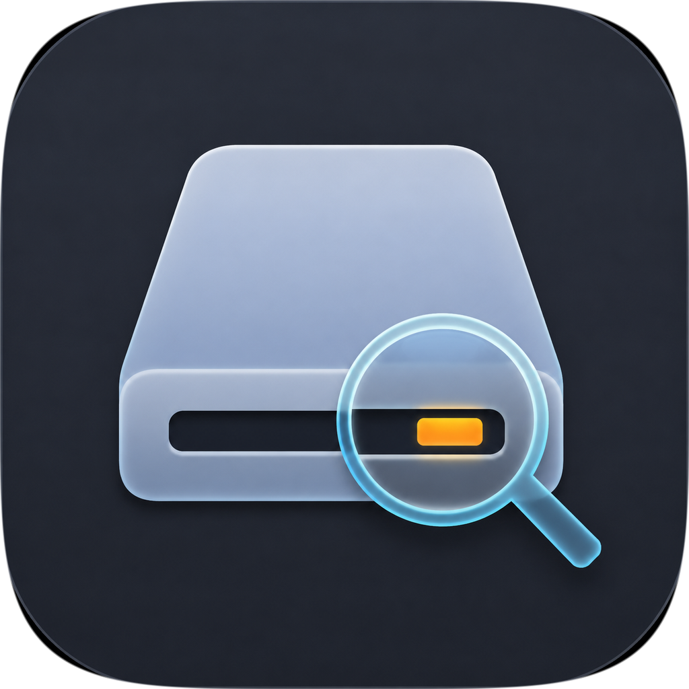
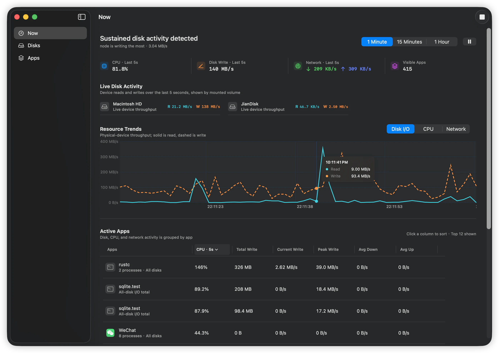
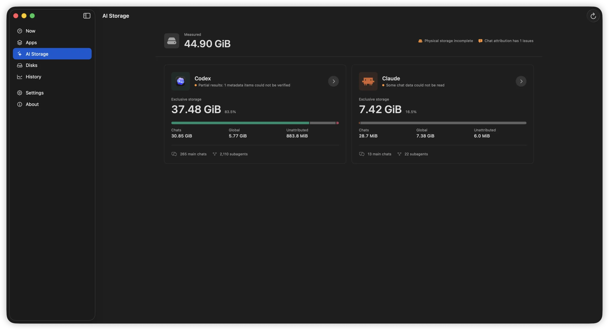
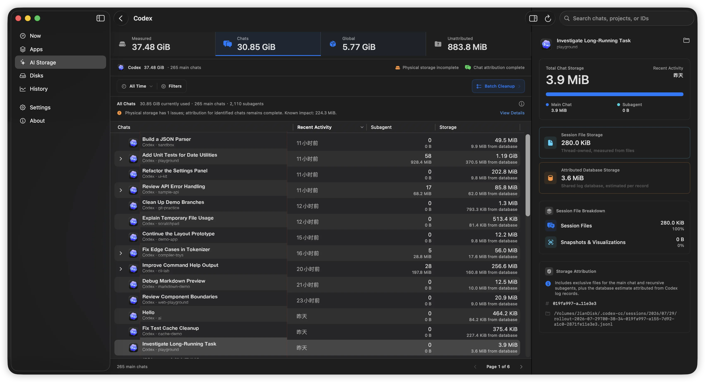
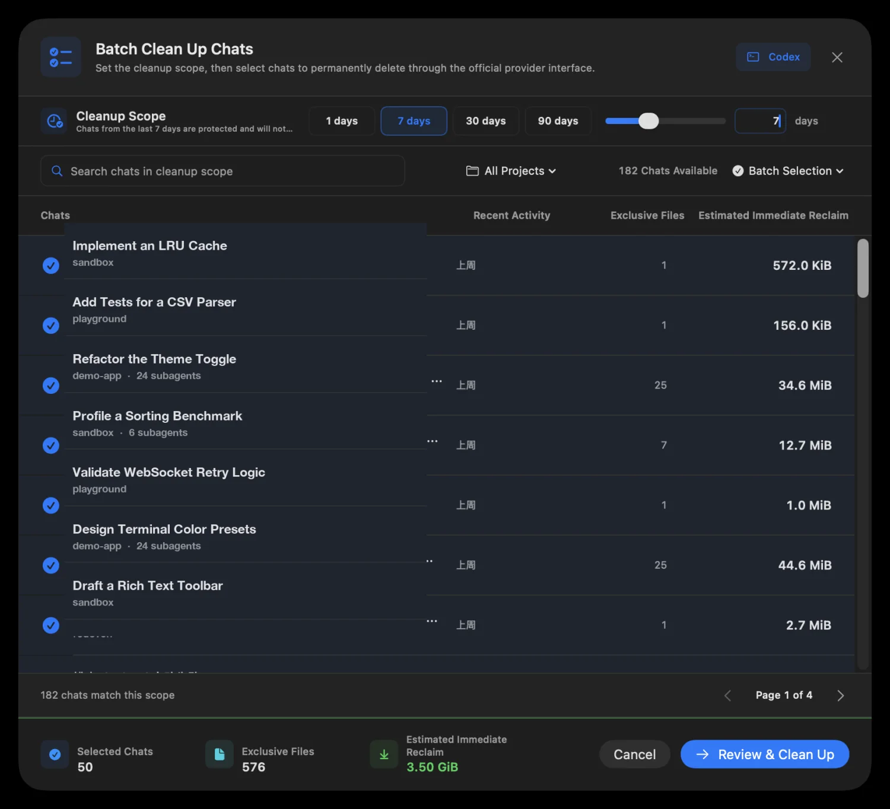
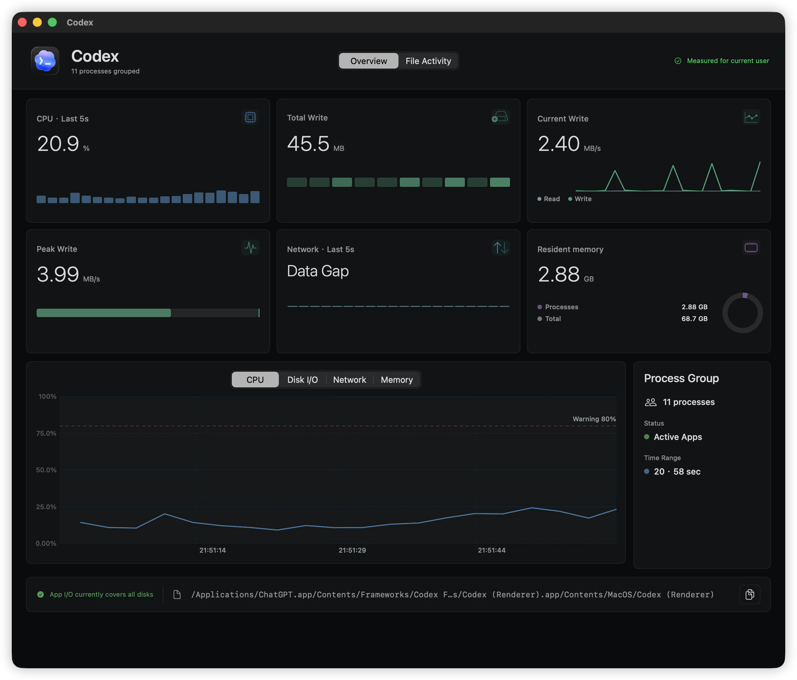
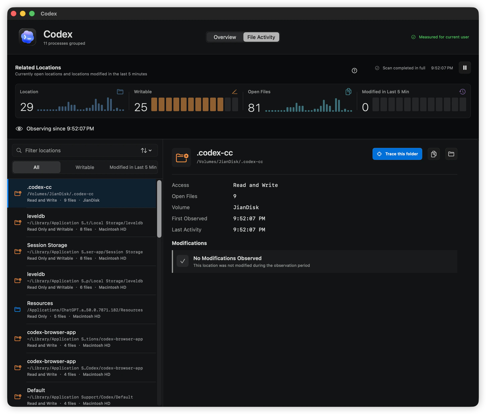
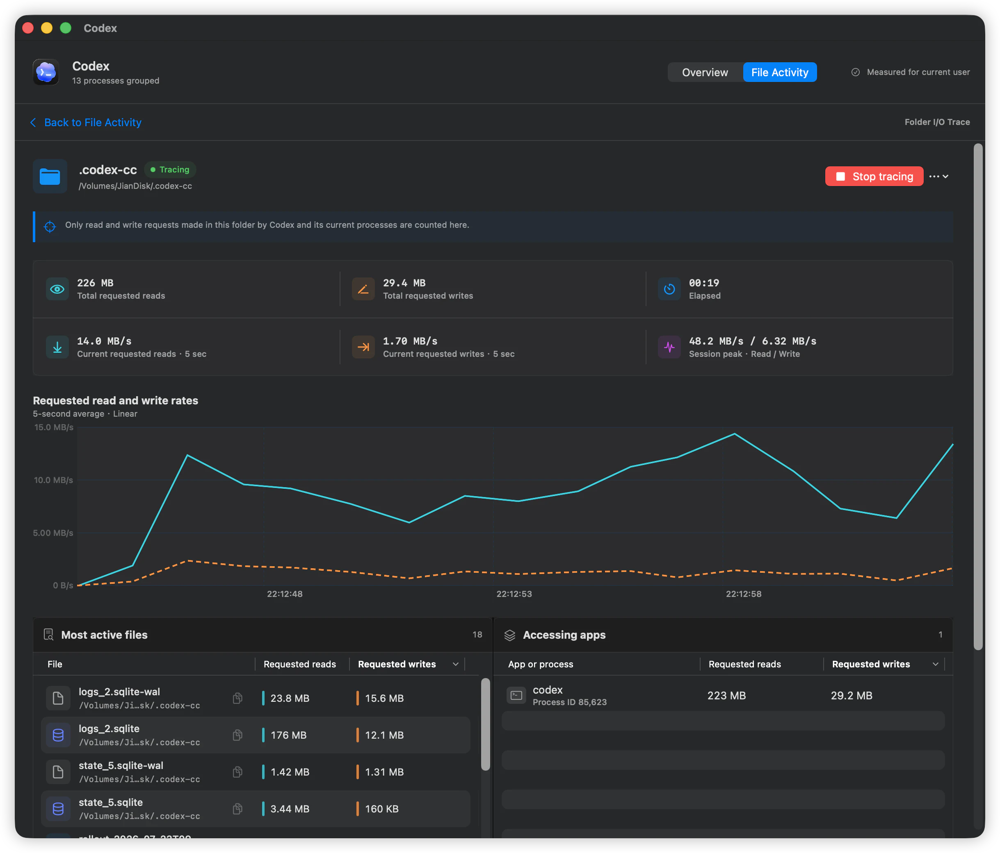
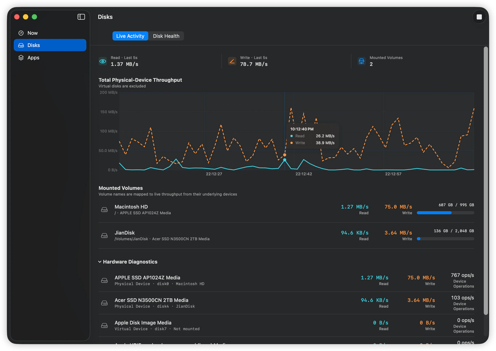
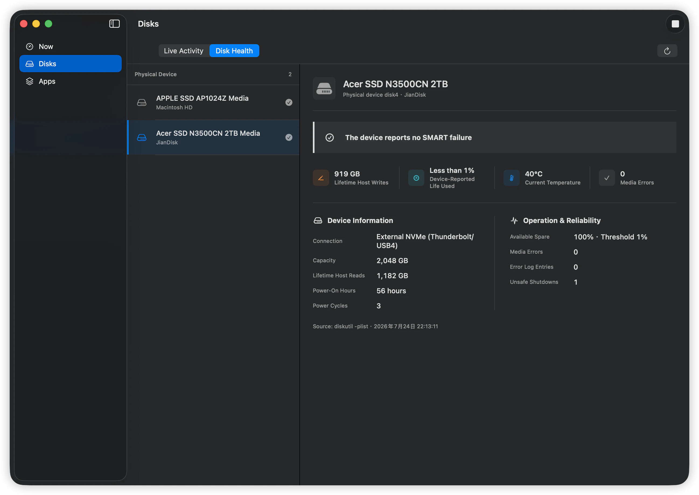

<div align="center">
  
  <h1>FindDiskKiller</h1>
  <p><strong>看清楚是誰持續使用你的磁碟。</strong></p>
  <p>在一個原生 macOS 工作區中整合 App 磁碟 I/O、CPU、網路、檔案活動與磁碟健康證據。</p>
  <p>
    <a href="README.md">English</a> · <a href="README.zh-CN.md">简体中文</a> ·
    <a href="README.zh-TW.md">繁體中文</a> · <a href="README.ja.md">日本語</a> ·
    <a href="README.ko.md">한국어</a> · <a href="README.de.md">Deutsch</a> ·
    <a href="README.fr.md">Français</a> · <a href="README.es.md">Español</a> ·
    <a href="README.pt-BR.md">Português (Brasil)</a> · <a href="README.ru.md">Русский</a>
  </p>
  <p><strong>macOS 14+ · Apple 晶片與 Intel · 本機處理 · 10 種介面語言</strong></p>
  <p><a href="https://finddiskkiller.com/zh-tw/download/">下載</a> · <a href="https://finddiskkiller.com/zh-tw/">官網</a> · <a href="docs/find-disk-killer-product-and-technical-plan.md">產品模型</a> · <a href="SUPPORT.md">支援</a> · <a href="PRIVACY.md">隱私權</a></p>
</div>

---

<p align="center">
  
</p>
<p align="center"><sub>找出持續磁碟活動，以及背後的 App。</sub></p>

當 Mac 發熱、磁碟持續忙碌，而單純的程序列表又無法解釋原因時，FindDiskKiller
會把調查重新整理成以 App 為中心的流程：先找出持續負載，再查看相關 App 的 CPU、
磁碟、網路、檔案與儲存裝置資訊，不必在多個工具之間拼湊線索。

## AI Agents 也會占用大量磁碟空間

AI Storage 只在你明確按下分析後，才會測量 Codex 與 Claude 的資料，並將可識別的占用歸因到具體 thread/session、主對話與遞迴子代理。物理檔案與資料庫估算會分開標示，缺少證據時不會假裝精確。

<p align="center"></p>

<p align="center"></p>

選擇時間範圍、專案或個別對話後，可在永久刪除前檢查預計立即釋放空間。Codex 使用官方 thread/delete，獨立 Claude Code session 使用官方 Agent SDK；活動中、identity 改變或不受支援的項目會跳過，且絕不改寫 SQLite 或手動刪除 transcript。Claude Desktop/Cowork 目前必須在 Claude Desktop 內刪除。

<p align="center"></p>

## 一眼掌握

| 工作區 | 提供的資訊 |
| --- | --- |
| **App 活動** | 最近 5 秒的 CPU、讀取、寫入、下載與上傳；可排序、調整欄寬並顯示原生 App 圖示 |
| **時間趨勢** | 1 分鐘、15 分鐘與 1 小時直線折線，懸停可查看精確時間與數值 |
| **程序詳細資料** | 使用獨立視窗並排比較 App 的 CPU、磁碟、網路與檔案證據 |
| **檔案活動** | 目前開啟的位置，以及最近 5 分鐘內觀察到變更的目錄 |
| **檔案存取追蹤** | 隨選查看請求讀寫總量、最近 5 秒速率、工作階段峰值、活躍檔案與已驗證程序 |
| **磁碟** | 以使用者熟悉的掛載卷宗名稱顯示實體裝置吞吐量，包含外接儲存裝置 |
| **磁碟健康狀態** | macOS 有提供時，顯示溫度、累計主機寫入、耗損、備用空間、通電記錄與錯誤 |
| **選單列** | 安靜查看目前狀態，不用重複通知打擾使用者 |

## 從 App 到磁碟的完整視圖

### 先確認負責的 App

<p align="center">
  
</p>

### 再查看檔案位置與有範圍限制的存取證據

<p align="center">
  
</p>

<p align="center">
  
</p>

### 最後核對儲存裝置與健康資訊

<p align="center">
  
</p>

<p align="center">
  
</p>

## 完整而連貫的調查流程

```text
發現持續負載
      |
      v
找出主要 App  -->  CPU / 磁碟 / 下載 / 上傳
      |
      v
查看開啟的檔案與最近變更
      |
      v
視需要啟動有時限的檔案或目錄追蹤
      |
      v
核對實體裝置吞吐量與可用的健康證據
```

CPU 固定排在第一項，讀取與寫入分開，下載與上傳分開；即時值採用最近 5 秒；
懸停時列表會暫停視覺重新排序但仍可點擊；程序詳細資料則在獨立視窗開啟。

## 不製造虛假的精確度

- **App 磁碟 I/O** 來自程序計數器，代表該程序使用所有儲存裝置的總量。
- **裝置吞吐量** 來自實體裝置計數器，並以 `Macintosh HD`、`ExternalSSD` 等卷宗名稱呈現。
- **最近變更** 只表示系統觀察到某個位置發生變更，無法單獨確認修改程序。
- **檔案存取追蹤** 統計成功系統呼叫所請求的位元組。快取、APFS 回寫、壓縮、
  寫入時複製、記憶體映射與覆蓋缺口，都會讓它不同於實體磁碟或 NAND 寫入。
- **磁碟健康狀態** 只顯示 macOS 實際提供的欄位；缺少的值會顯示為無法取得，而不是零。

產品不會宣稱能精確計算任意程序向某個實體磁碟寫入的每一個位元組。

## 隱私權與權限

監控與分析都在本機完成。現行版本不包含廣告、遙測、行為分析或第三方追蹤 SDK，
也不會上傳程序活動、檔案路徑、監控記錄或磁碟序號。

基本監控不需要管理員核准。只有在你明確開始追蹤檔案或目錄時，macOS 才可能要求
核准 FindDiskKiller 的簽署背景元件。它只能監管參數固定且有時限的
`/usr/bin/fs_usage` 工作階段，不能執行 shell 或任意指令，也能在設定中停用及移除。

完整說明請參閱 [隱私權政策](PRIVACY.md) 與 [安全性政策](SECURITY.md)。

## 系統需求與安裝

- macOS 14 或更新版本
- Apple 晶片或 Intel Mac
- 只有啟用隨選檔案存取追蹤時才需要管理員帳號

正式版本發佈後，將以 Developer ID 簽署、經 Apple 公證的 universal2 DMG 提供：

1. 從[官網](https://finddiskkiller.com/zh-tw/download/)下載最新版。
2. 開啟 DMG，將 FindDiskKiller 拖入「應用程式」。
3. 從「應用程式」啟動 FindDiskKiller。

每個正式版本都會公佈 SHA-256。若套件無法通過 Gatekeeper 驗證，請勿略過系統安全檢查。

## 建置與測試

開發需要 Xcode 16 或更新版本，以及 XcodeGen 2.42.0 或更新版本。

```bash
git clone https://github.com/jianyintang/find-disk-killer.git
cd find-disk-killer
xcodegen generate
xcodebuild -project FindDiskKiller.xcodeproj \
  -scheme FindDiskKillerApp -configuration Release \
  -destination 'generic/platform=macOS' \
  CODE_SIGNING_ALLOWED=NO ONLY_ACTIVE_ARCH=NO build
swift test
```

未簽署的開發建置可驗證基礎監控，但無法完成需要特權的檔案或資料夾追蹤。App 與 helper
會透過維護者的 Team ID 相互驗證，因此該流程必須使用官方簽署的建置驗證。核准背景元件
與為受保護位置授予「完整磁碟存取權」是兩項獨立的 macOS 權限，前者不會自動授予後者。

從乾淨的提交建立已簽署並公證的官網發佈套件：

```bash
make lint test
make release VERSION=1.0.0 BUILD_NUMBER=100
```

使用 `SKIP_NOTARIZATION=1` 產生的內容僅供本機演練，絕不能公開發佈。

## 文件與支援

- [產品與技術方案](docs/find-disk-killer-product-and-technical-plan.md)
- [深度檔案追蹤與 SSD 健康方案](docs/find-disk-killer-deep-tracing-and-ssd-health-plan.md)
- [官網發佈檢查表](docs/website-release-checklist.md)
- [參與貢獻](CONTRIBUTING.md)
- [支援](SUPPORT.md) · [隱私權](PRIVACY.md) · [安全性](SECURITY.md) · [第三方聲明](THIRD_PARTY_NOTICES.md)

一般問題請使用 [GitHub Issues](https://github.com/jianyintang/find-disk-killer/issues)。
安全漏洞請透過 [GitHub Security Advisories](https://github.com/jianyintang/find-disk-killer/security/advisories/new)
私下回報，並遮蔽診斷資料中的路徑、使用者名稱與序號。

FindDiskKiller 採用 [MIT License](LICENSE) 開放原始碼。第三方 App 標誌僅用於
識別觀察到的軟體，不代表合作、認可或背書。
